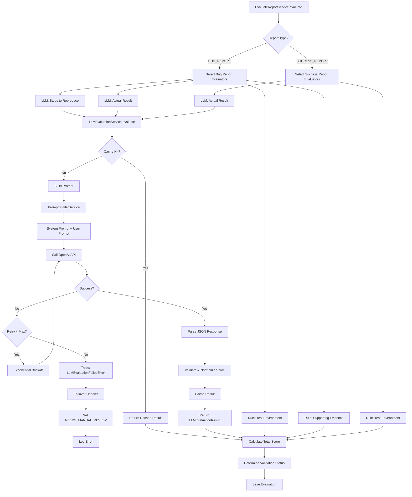
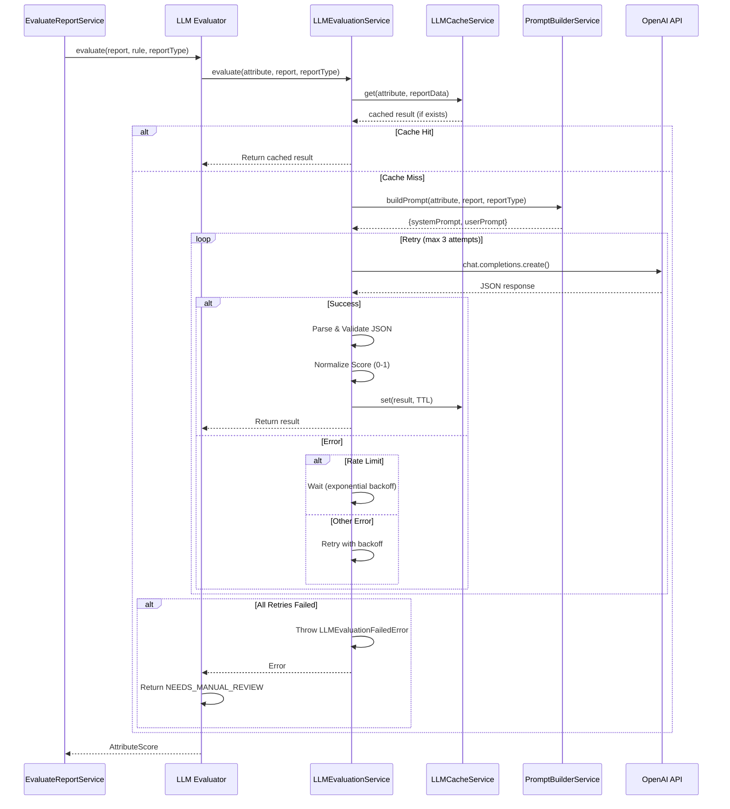
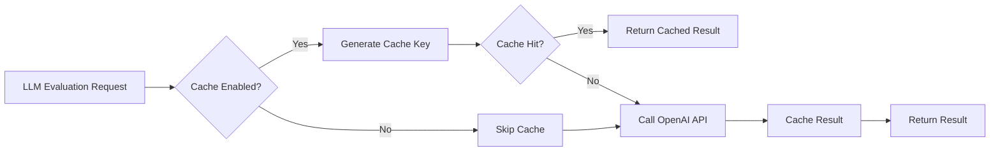

# Dokumentasi Implementasi LLM Evaluation System

## Daftar Isi
1. [Overview](#overview)
2. [Model LLM yang Digunakan](#model-llm-yang-digunakan)
3. [Arsitektur Sistem](#arsitektur-sistem)
4. [Flow Evaluasi](#flow-evaluasi)
5. [Prompt Engineering](#prompt-engineering)
6. [Caching Mechanism](#caching-mechanism)
7. [Error Handling & Failover](#error-handling--failover)
8. [Cost Control Strategy](#cost-control-strategy)
9. [Konfigurasi](#konfigurasi)
10. [Struktur Data](#struktur-data)

---

## Overview

Sistem evaluasi menggunakan **hybrid model** yang menggabungkan:
- **LLM-based evaluation**: Untuk atribut yang memerlukan pemahaman semantik (Steps to Reproduce, Actual Result)
- **Rule-based evaluation**: Untuk atribut struktural (Test Environment, Supporting Evidence, Expected Result)

### Tujuan
Menggantikan evaluasi berbasis jumlah karakter dengan evaluasi semantik berbasis LLM untuk mendapatkan penilaian yang lebih akurat secara akademik.

---

## Model LLM yang Digunakan

### Model: GPT-4o
- **Default Model**: `gpt-4o` (dapat diubah via environment variable)
- **Provider**: OpenAI API
- **Temperature**: 0.2 (untuk konsistensi hasil)
- **Max Tokens**: 200 (untuk mengontrol biaya)
- **Response Format**: JSON Object (structured output)

### Konfigurasi Model
```typescript
// farhan-be/src/llm/config/llm.config.ts
model: process.env.OPENAI_MODEL || 'gpt-4o'
temperature: 0.2
timeout: 30000ms
maxRetries: 3
```

### Alasan Pemilihan GPT-4o
1. **Kualitas Evaluasi**: Kemampuan pemahaman semantik yang lebih baik
2. **Bahasa Indonesia**: Dukungan yang baik untuk Bahasa Indonesia
3. **Structured Output**: Mendukung JSON response format
4. **Cost Efficiency**: Lebih efisien dibanding GPT-4 Turbo untuk use case ini

---

## Arsitektur Sistem

### Komponen Utama

```
┌─────────────────────────────────────────────────────────┐
│              EvaluateReportService                      │
│  (Mengkoordinasikan evaluasi semua atribut)              │
└──────────────────┬──────────────────────────────────────┘
                   │
       ┌───────────┴───────────┐
       │                       │
┌──────▼──────────┐   ┌────────▼──────────┐
│ LLM Evaluators  │   │ Rule-Based        │
│                 │   │ Evaluators        │
│ - Steps to      │   │ - Test Environment│
│   Reproduce     │   │ - Supporting      │
│ - Actual Result │   │   Evidence        │
└──────┬──────────┘   └───────────────────┘
       │
┌──────▼──────────────────────────────────┐
│      LLMEvaluationService               │
│  - Cache Management                     │
│  - Retry Logic                         │
│  - Error Handling                      │
└──────┬──────────────────────────────────┘
       │
┌──────▼──────────────────────────────────┐
│      PromptBuilderService              │
│  - Build System Prompt                 │
│  - Build User Prompt                  │
│  - Bahasa Indonesia                    │
└──────┬──────────────────────────────────┘
       │
┌──────▼──────────────────────────────────┐
│      OpenAI API                        │
│  - GPT-4o Model                        │
│  - JSON Response                       │
└────────────────────────────────────────┘
```

### File Struktur

```
farhan-be/src/llm/
├── config/
│   └── llm.config.ts              # Konfigurasi LLM
├── services/
│   ├── llm-evaluation.service.ts  # Service utama evaluasi LLM
│   ├── prompt-builder.service.ts  # Builder untuk prompt
│   └── llm-cache.service.ts       # Caching mechanism
├── errors/
│   └── llm-evaluation-failed.error.ts  # Custom error
└── llm.module.ts                   # NestJS module

farhan-be/src/evaluations/services/evaluators/
├── llm-steps-to-reproduce.evaluator.ts    # Evaluator LLM untuk Steps
├── llm-actual-result.evaluator.ts         # Evaluator LLM untuk Actual Result
└── llm-description-success.evaluator.ts   # Evaluator LLM untuk Success Report
```

---

## Flow Evaluasi

### 1. Flow Utama Evaluasi Report



### 2. Flow Detail LLM Evaluation



---

## Prompt Engineering

### Struktur Prompt

Setiap evaluasi menggunakan **2-prompt system**:
1. **System Prompt**: Instruksi umum dan format response
2. **User Prompt**: Data spesifik laporan yang dievaluasi

### System Prompts

#### 1. Steps to Reproduce System Prompt
```typescript
Anda adalah evaluator quality assurance ahli yang mengkhususkan diri dalam 
mengevaluasi kemampuan reproduksi test case. Tugas Anda adalah mengevaluasi 
Langkah-langkah untuk Reproduksi untuk laporan bug dan memberikan penilaian semantik.

Format Response:
{"score": 0.0-1.0, "status": "VALID|AMBIGUOUS|INVALID", "reasoning": "...", "issues": [...]}

Status Mapping:
- VALID: score >= 0.7 - Langkah-langkah tersusun secara logis, dapat direproduksi, dan lengkap
- AMBIGUOUS: 0.4 <= score < 0.7 - Langkah-langkah memiliki beberapa masalah
- INVALID: score < 0.4 - Langkah-langkah tidak jelas, tidak logis, atau tidak lengkap
```

#### 2. Actual Result System Prompt
```typescript
Anda adalah evaluator quality assurance ahli yang mengkhususkan diri dalam 
mengevaluasi deskripsi laporan bug. Tugas Anda adalah mengevaluasi deskripsi 
Hasil Aktual dan memberikan penilaian semantik.

Format Response:
{"score": 0.0-1.0, "reasoning": "...", "qualityFlags": {...}}

Quality Flags:
- isConsistent: Konsisten dengan judul
- isClear: Jelas dan mudah dipahami
- isContradictory: Ada kontradiksi
- isTooGeneric: Terlalu umum/samar
- hasBias: Ada bias
- isAmbiguous: Ambigu/tidak jelas
```

### User Prompts

#### Steps to Reproduce User Prompt
```
Evaluasi atribut Langkah-langkah untuk Reproduksi untuk laporan bug ini:

Judul Laporan: [title]

Langkah-langkah untuk Reproduksi:
1. [step 1]
2. [step 2]
...

Konteks:
- Hasil Aktual: [actualResult]
- Hasil yang Diharapkan: [expectedResult]

Kriteria Evaluasi Semantik:
1. Validitas Urutan (0.3 poin)
2. Hubungan Sebab-Akibat (0.3 poin)
3. Kemampuan Reproduksi (0.2 poin)
4. Kelengkapan (0.2 poin)
```

#### Actual Result User Prompt (Bug Report)
```
Evaluasi atribut Hasil Aktual untuk laporan bug ini:

Judul Laporan: [title]

Hasil Aktual:
[actualResult]

Hasil yang Diharapkan:
[expectedResult]

Kriteria Evaluasi Semantik:
1. Konsistensi dengan Judul (0.2 poin)
2. Kejelasan Perilaku Sistem (0.3 poin)
3. Tidak Kontradiktif (0.2 poin)
4. Spesifisitas (0.2 poin)
5. Kelengkapan (0.1 poin)
```

### Prompt Builder Service

**File**: `farhan-be/src/llm/services/prompt-builder.service.ts`

**Method Utama**:
- `buildPrompt(attribute, report, reportType)`: Membangun prompt lengkap
- `getSystemPrompt(attribute, reportType)`: Membangun system prompt
- `getUserPrompt(attribute, report, reportType)`: Membangun user prompt

**Method Spesifik per Atribut**:
- `buildStepsToReproducePrompt()`: Prompt untuk Steps to Reproduce
- `buildActualResultPrompt()`: Prompt untuk Actual Result (Bug & Success)
- `buildTestEnvironmentPrompt()`: Prompt untuk Test Environment
- `buildExpectedResultPrompt()`: Prompt untuk Expected Result
- `buildSupportingEvidencePrompt()`: Prompt untuk Supporting Evidence
- `buildSeverityLevelPrompt()`: Prompt untuk Severity Level
- `buildInformationConsistencyPrompt()`: Prompt untuk Information Consistency
- `buildTestIdentityPrompt()`: Prompt untuk Test Identity

---

## Caching Mechanism

### Tujuan Caching
1. **Cost Reduction**: Mengurangi panggilan API OpenAI yang berulang
2. **Performance**: Response lebih cepat untuk data yang sama
3. **Consistency**: Hasil evaluasi konsisten untuk input yang sama

### Implementasi Cache

**Service**: `LLMCacheService`
**Storage**: In-memory cache (NestJS CacheManager)
**TTL**: 24 jam (86400000ms) - dapat dikonfigurasi

### Cache Key Generation

```typescript
// Menggunakan SHA-256 hash dari:
- attribute type
- testId
- version
- actualResult
- expectedResult
- stepsToReproduce
- testEnvironment
- supportingEvidence
- severityLevel

Cache Key Format: `llm:eval:{attribute}:{hash}`
```

### Cache Flow



### Konfigurasi Cache

```typescript
// Environment Variables
LLM_CACHE_ENABLED=true  // default: true
LLM_CACHE_TTL=86400000  // 24 hours in milliseconds
```

---

## Error Handling & Failover

### Retry Mechanism

**Max Retries**: 3 attempts
**Backoff Strategy**: Exponential backoff
- Rate limit errors: Max 10 seconds wait
- Other errors: Max 5 seconds wait

```typescript
// Retry Logic
for (attempt = 1; attempt <= maxRetries; attempt++) {
  try {
    result = await callOpenAI();
    return result;
  } catch (error) {
    if (rateLimit) {
      waitTime = min(1000 * 2^attempt, 10000);
    } else {
      waitTime = min(1000 * 2^(attempt-1), 5000);
    }
    await sleep(waitTime);
  }
}
```

### Failover Strategy

Ketika semua retry gagal:

1. **Throw LLMEvaluationFailedError**
2. **Evaluator menangkap error**
3. **Return AttributeScore dengan**:
   - `score: 0`
   - `evaluationStatus: 'NEEDS_MANUAL_REVIEW'`
   - `reasoning: "LLM evaluation failed: [error message]"`

4. **Log error ke `llmEvaluationErrors` array**
5. **Set `requiresManualReview: true` pada evaluation**

### Error Types

```typescript
// LLMEvaluationFailedError
- attribute: AttributeType yang gagal
- originalError: Error asli dari OpenAI
- retryAttempts: Jumlah percobaan yang dilakukan
```

### Error Logging

Errors disimpan dalam evaluation document:
```typescript
llmEvaluationErrors: [
  {
    attribute: AttributeType.STEPS_TO_REPRODUCE,
    error: "Request timeout after 30000ms",
    timestamp: Date
  }
]
```

---

## Cost Control Strategy

### Atribut yang Menggunakan LLM

**Hanya 2 atribut per report**:
1. **Steps to Reproduce** (untuk Bug Report)
2. **Actual Result** (untuk Bug Report & Success Report)

### Atribut Rule-Based

Atribut berikut menggunakan evaluasi rule-based (tidak memanggil LLM):
- **Test Environment**: Boolean check (OS, Browser, Device provided)
- **Supporting Evidence**: Boolean check (at least one evidence)
- **Expected Result**: Boolean check (meaningful content)
- **Severity Level**: Rule-based matching
- **Information Consistency**: Rule-based comparison

### Cost Optimization

1. **Caching**: Hasil evaluasi di-cache selama 24 jam
2. **Limited Attributes**: Hanya 2 atribut menggunakan LLM
3. **Max Tokens**: 200 tokens per request (membatasi output)
4. **Temperature**: 0.2 (konsistensi, mengurangi variasi)

### Perkiraan Biaya

**Per Evaluasi Bug Report**:
- Steps to Reproduce: ~1 request
- Actual Result: ~1 request
- **Total: 2 LLM calls per report**

**Dengan Caching**:
- Jika report sama dievaluasi ulang dalam 24 jam: 0 calls (cache hit)
- **Penghematan: ~50-80%** tergantung tingkat duplikasi

---

## Konfigurasi

### Environment Variables

```bash
# OpenAI Configuration
OPENAI_API_KEY=sk-...                    # Required
OPENAI_MODEL=gpt-4o                      # Default: gpt-4o
OPENAI_TEMPERATURE=0.2                   # Default: 0.2
OPENAI_TIMEOUT=30000                     # Default: 30000ms
OPENAI_MAX_RETRIES=3                     # Default: 3

# Cache Configuration
LLM_CACHE_ENABLED=true                   # Default: true
LLM_CACHE_TTL=86400000                   # Default: 24 hours
```

### Config File

**File**: `farhan-be/src/llm/config/llm.config.ts`

```typescript
export default registerAs('llm', () => ({
  apiKey: process.env.OPENAI_API_KEY || '',
  model: process.env.OPENAI_MODEL || 'gpt-4o',
  temperature: process.env.OPENAI_TEMPERATURE 
    ? parseFloat(process.env.OPENAI_TEMPERATURE) 
    : 0.2,
  timeout: process.env.OPENAI_TIMEOUT 
    ? parseInt(process.env.OPENAI_TIMEOUT, 10) 
    : 30000,
  maxRetries: process.env.OPENAI_MAX_RETRIES 
    ? parseInt(process.env.OPENAI_MAX_RETRIES, 10) 
    : 3,
  cacheEnabled: process.env.LLM_CACHE_ENABLED !== 'false',
  cacheTTL: process.env.LLM_CACHE_TTL 
    ? parseInt(process.env.LLM_CACHE_TTL, 10) 
    : 86400000,
}));
```

---

## Struktur Data

### LLMEvaluationResult

```typescript
interface LLMEvaluationResult {
  score: number;                    // 0.0 - 1.0
  reasoning: string;                // Penjelasan evaluasi (Bahasa Indonesia)
  status?: StepsToReproduceStatus;  // VALID | AMBIGUOUS | INVALID (untuk Steps)
  qualityFlags?: {                  // Untuk Actual Result
    isConsistent?: boolean;
    isClear?: boolean;
    isContradictory?: boolean;
    isTooGeneric?: boolean;
    hasBias?: boolean;
    isAmbiguous?: boolean;
  };
  issues?: string[];                // Daftar masalah (untuk Steps)
}
```

### Response Format dari OpenAI

**Steps to Reproduce**:
```json
{
  "score": 0.85,
  "status": "VALID",
  "reasoning": "Langkah-langkah tersusun dengan baik dan dapat direproduksi...",
  "issues": []
}
```

**Actual Result**:
```json
{
  "score": 0.75,
  "reasoning": "Deskripsi hasil aktual jelas dan konsisten dengan judul...",
  "qualityFlags": {
    "isConsistent": true,
    "isClear": true,
    "isContradictory": false,
    "isTooGeneric": false,
    "hasBias": false,
    "isAmbiguous": false
  }
}
```

### AttributeScore (Output Evaluator)

```typescript
interface AttributeScore {
  attribute: AttributeType;
  score: number;
  maxScore: number;
  weight: number;
  weightedScore: number;
  passed: boolean;
  reasoning?: string;              // Dari LLM
  evaluationStatus?: 'VALID' | 'AMBIGUOUS' | 'INVALID' | 'NEEDS_MANUAL_REVIEW';
  qualityFlags?: QualityFlags;     // Dari LLM (untuk Actual Result)
}
```

---

## Contoh Penggunaan

### 1. Evaluasi Steps to Reproduce

```typescript
// Di LLMStepsToReproduceEvaluator
const result = await llmEvaluationService.evaluate(
  AttributeType.STEPS_TO_REPRODUCE,
  report,
  ReportType.BUG_REPORT
);

// Result:
{
  score: 0.85,
  status: "VALID",
  reasoning: "Langkah-langkah tersusun secara logis dengan urutan yang jelas...",
  issues: []
}
```

### 2. Evaluasi Actual Result

```typescript
// Di LLMActualResultEvaluator
const result = await llmEvaluationService.evaluate(
  AttributeType.ACTUAL_RESULT,
  report,
  ReportType.BUG_REPORT
);

// Result:
{
  score: 0.75,
  reasoning: "Deskripsi hasil aktual jelas dan spesifik...",
  qualityFlags: {
    isConsistent: true,
    isClear: true,
    isContradictory: false,
    isTooGeneric: false,
    hasBias: false,
    isAmbiguous: false
  }
}
```

### 3. Error Handling

```typescript
try {
  const result = await llmEvaluationService.evaluate(...);
  return attributeScore;
} catch (error) {
  if (error instanceof LLMEvaluationFailedError) {
    return {
      attribute: AttributeType.STEPS_TO_REPRODUCE,
      score: 0,
      evaluationStatus: 'NEEDS_MANUAL_REVIEW',
      reasoning: `LLM evaluation failed: ${error.originalError.message}`
    };
  }
  throw error;
}
```

---

## Monitoring & Logging

### Log Points

1. **Cache Hit/Miss**: `Cache hit for attribute: {attribute}`
2. **API Call**: Setiap panggilan OpenAI API
3. **Retry Attempts**: `OpenAI API call failed (attempt {n}/{max})`
4. **Final Failure**: `All retry attempts failed for attribute {attribute}`
5. **Success**: Hasil evaluasi berhasil (tidak di-log secara eksplisit)

### Metrics yang Bisa Dimonitor

1. **Cache Hit Rate**: Persentase cache hit vs miss
2. **API Call Count**: Jumlah panggilan OpenAI per hari
3. **Error Rate**: Persentase evaluasi yang gagal
4. **Average Response Time**: Waktu rata-rata evaluasi LLM
5. **Cost per Evaluation**: Estimasi biaya per evaluasi

---

## Best Practices

### 1. Prompt Design
- ✅ Gunakan Bahasa Indonesia untuk konsistensi
- ✅ Berikan instruksi yang jelas dan spesifik
- ✅ Sertakan contoh format response
- ✅ Batasi panjang prompt untuk efisiensi

### 2. Error Handling
- ✅ Selalu implementasikan retry mechanism
- ✅ Log errors untuk debugging
- ✅ Fallback ke manual review pada failure
- ✅ Jangan biarkan error menghentikan evaluasi atribut lain

### 3. Cost Management
- ✅ Gunakan caching untuk mengurangi API calls
- ✅ Batasi atribut yang menggunakan LLM
- ✅ Monitor penggunaan API secara berkala
- ✅ Set max_tokens yang wajar (200 cukup)

### 4. Performance
- ✅ Run evaluators secara parallel
- ✅ Gunakan cache untuk data yang sama
- ✅ Set timeout yang wajar (30s)
- ✅ Monitor response time

---

## Troubleshooting

### Masalah: LLM selalu timeout
**Solusi**:
- Periksa koneksi internet
- Increase `OPENAI_TIMEOUT` (default: 30000ms)
- Periksa rate limits OpenAI

### Masalah: Cache tidak bekerja
**Solusi**:
- Pastikan `LLM_CACHE_ENABLED=true`
- Periksa cache key generation
- Verifikasi cache TTL

### Masalah: Response tidak dalam format JSON
**Solusi**:
- Pastikan `response_format: { type: 'json_object' }` di-set
- Periksa prompt untuk memastikan instruksi JSON jelas
- Validasi response sebelum parsing

### Masalah: Biaya terlalu tinggi
**Solusi**:
- Aktifkan caching
- Pastikan hanya 2 atribut menggunakan LLM
- Monitor cache hit rate
- Pertimbangkan reduce max_tokens jika perlu

---

## Referensi File

### Core Files
- `farhan-be/src/llm/services/llm-evaluation.service.ts` - Service utama
- `farhan-be/src/llm/services/prompt-builder.service.ts` - Prompt builder
- `farhan-be/src/llm/services/llm-cache.service.ts` - Cache service
- `farhan-be/src/llm/config/llm.config.ts` - Konfigurasi

### Evaluators
- `farhan-be/src/evaluations/services/evaluators/llm-steps-to-reproduce.evaluator.ts`
- `farhan-be/src/evaluations/services/evaluators/llm-actual-result.evaluator.ts`
- `farhan-be/src/evaluations/services/evaluators/llm-description-success.evaluator.ts`

### Errors
- `farhan-be/src/llm/errors/llm-evaluation-failed.error.ts`

---

## Changelog

### v2.0 (Current)
- ✅ Migrasi dari character-count ke semantic evaluation
- ✅ Implementasi GPT-4o
- ✅ Prompt dalam Bahasa Indonesia
- ✅ Caching mechanism
- ✅ Failover ke NEEDS_MANUAL_REVIEW
- ✅ Cost control (hanya 2 atribut menggunakan LLM)

### v1.0 (Legacy)
- ❌ Evaluasi berbasis jumlah karakter
- ❌ Tidak menggunakan LLM untuk semantic evaluation

---

## Kontak & Support

Untuk pertanyaan atau masalah terkait implementasi LLM:
1. Periksa logs untuk error messages
2. Verifikasi konfigurasi environment variables
3. Pastikan OpenAI API key valid
4. Check cache status jika hasil tidak konsisten

